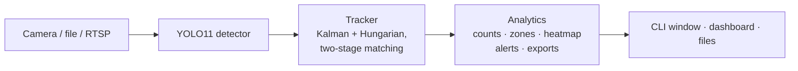

# FlowCount — Real-Time Traffic Analytics


Point FlowCount at a webcam, video file, or IP camera and it detects vehicles,
tracks them with stable IDs, and turns the footage into traffic metrics:
counts, wrong-way alerts, zone occupancy, heatmaps, and exports.


**What you're watching:** a built-in synthetic traffic scene (cartoon vehicles,
no AI model or camera needed) running through the *real* detection → tracking →
analytics pipeline. Each vehicle gets a box and a persistent ID (`car #6`),
the yellow **count line** tallies vehicles as they cross, the blue **zone**
reports occupancy, and the red flash is the **WRONG WAY alert** catching the
car driving against traffic. On real footage, YOLO detections replace the
cartoon vehicles — everything else is identical.

| The activity heatmap: where vehicles spend their time — busy lanes glow |
|---|
|  |

---

## Features

- **Detection** — YOLO11 / YOLOv8, with automatic fallback to open-vocabulary
  YOLO-World for classes outside COCO.
- **Tracking** — ByteTrack-style two-stage matching on a custom SORT core
  (Kalman filter + Hungarian assignment). IDs survive occlusions, and a truck
  never inherits a car's ID.
- **Live mode** — background capture that drops stale frames (no latency
  build-up), detect-every-N frame skipping for CPU machines, and RTSP cameras
  with auto-reconnect.
- **Counting & alerts** — per-class in/out counts at virtual lines, wrong-way
  detection, polygon zones with occupancy + dwell time.
- **Outputs** — activity heatmaps, event-triggered clips, CSV/SQLite export,
  annotated video.
- **Web dashboard** — live stream + stats in the browser (FastAPI + WebSocket),
  with a Docker image ready for a free public deploy.

---

## Quickstart

```bash
pip install -e ".[yolo,web,demo]"
```

Weights download automatically on first real use (default: YOLO11n, needs
`ultralytics>=8.3`). GPU is used when available; everything below except real
footage also works with no ML dependencies at all.

**See it work instantly** (no model, no camera — regenerates the GIF above):

```bash
python scripts/demo.py
```

**Live webcam:**

```bash
flowcount --input 0 --live                # desktop window
flowcount-web --input 0 --live            # browser dashboard at :8000
```

**Real footage / IP cameras:**

```bash
# Count vehicles crossing a line, save a heatmap and a CSV
flowcount --input traffic.mp4 --count-line 640,0,640,720 --heatmap --export-csv runs/traffic.csv

# IP camera with wrong-way alerts and event clips
flowcount --input rtsp://camera/stream --live \
    --count-line 640,0,640,720 --expect-direction in --record-events runs/clips

# Slow CPU? Detect on every 4th frame — tracks coast in between with stable IDs
flowcount --input 0 --live --detect-every 4 --imgsz 480
```

Window controls: `q` quit · `p` pause · `s` save frame.
Defaults live in [config.yaml](config.yaml); any flag overrides them.

**Web dashboard** (also works with zero setup — it defaults to the synthetic
scene):

```bash
uvicorn flowcount.web.server:app          # open http://127.0.0.1:8000
flowcount-web --input traffic.mp4         # or real footage / webcam / RTSP
```

Live MJPEG stream, counts, per-class breakdown, zone occupancy, recent events
(including wrong-way alerts), and a refreshing heatmap. The page loads
instantly while the model warms up; `/healthz` supports deploy health checks.

---

## Put it online (free public demo)

The Dockerfile serves the synthetic dashboard with no GPU or weights:

```bash
docker build -t flowcount . && docker run -p 7860:7860 flowcount
```

To host it on **Hugging Face Spaces**:

1. Create a Space at [huggingface.co/new-space](https://huggingface.co/new-space) — SDK: **Docker**, public.
2. `git remote add space https://huggingface.co/spaces/<user>/<space>`
3. `git push space main`

Your dashboard is now live at the Space URL, 24/7.

---

## How it works



One reusable [`Pipeline`](flowcount/pipeline.py) drives every front end — the
CLI, the dashboard, the demo, and the benchmarks share the exact same code
path. Architecture and tracker internals: [docs/DESIGN.md](docs/DESIGN.md).

**Performance:** tracking + analytics cost under 1 ms/frame (~360 FPS
end-to-end without a model); real-time behavior is set by YOLO inference,
which `--detect-every` and `--imgsz` trade against. Details:
[docs/benchmarks.md](docs/benchmarks.md).

---

## CLI reference

| Flag | Description |
|---|---|
| `--input`, `-i` | `0` = webcam, a file path, or an `rtsp://` URL |
| `--live` | Low-latency capture for cameras; implies `--detect-every 3` |
| `--detect-every N` | Run YOLO every Nth frame; tracks coast in between |
| `--model` / `--imgsz` / `--device` | Model name, inference size, `auto`/`cuda`/`cpu` |
| `--count-line x1,y1,x2,y2` | Line counter (repeatable) |
| `--expect-direction in\|out` | Wrong-way alerts against this direction |
| `--zone x1,y1,...` / `--dwell S` | Polygon zones, dwell events |
| `--heatmap` | Accumulate + save an activity heatmap |
| `--export-csv` / `--export-db PATH` | Export tracks + events |
| `--record-events DIR` | Save clips around each event |
| `--output`, `-o` | Write the annotated video |
| `--classes` / `--preset` | Class filter (non-COCO names auto-enable YOLO-World) |

---

## Project structure

```
flowcount/           the package: detector, tracker, pipeline, video sources,
                     analytics/ (counting, zones, heatmap, export), web/ dashboard
scripts/demo.py      regenerates the demo GIF + heatmap (synthetic or real footage)
scripts/bench.py     benchmark harness
docs/                DESIGN.md (architecture deep-dive), benchmarks.md
tests/               73 unit tests, no ML deps needed
```

## Roadmap

- [x] Detection, tracking, counting, zones, heatmaps, exports, clips
- [x] Web dashboard · live mode (webcam/RTSP, frame skipping) · wrong-way alerts
- [x] Packaging, CI, Docker, benchmarks
- [ ] Real-world km/h speed via camera calibration
- [ ] Draw count lines/zones in the browser · hosted live demo
- [ ] Fine-tune YOLO11 on a traffic dataset + MOT-metrics evaluation

## Development

```bash
pip install -e ".[web,demo,dev]"
pytest                                  # ~3s, no torch needed
ruff check . && ruff format --check .
```

## License

MIT — see [LICENSE](LICENSE).
