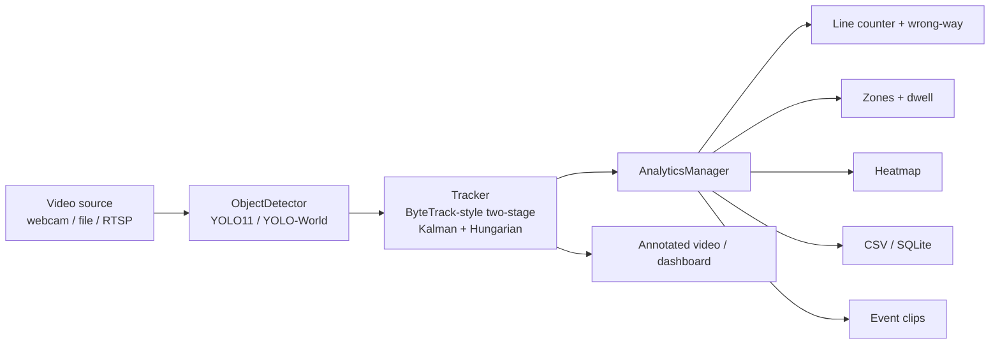

# FlowCount — Real-Time Traffic Analytics


Detect, track, **and count** vehicles in real time from a webcam, video file,
or RTSP/IP camera. FlowCount turns raw footage into actionable traffic
metrics: per-class vehicle counts at a line, wrong-way alerts, lane occupancy
and dwell time, congestion heatmaps, and auto-saved clips of every crossing.


> The GIF above is the **synthetic demo** (`python scripts/demo.py`) — it runs
> the real detection→tracking→analytics pipeline with no model or camera
> required, so anyone can see it work in seconds. The red flash is the
> **wrong-way alert** catching the car driving against traffic.

---

## Features

- 🚗 **Vehicle detection** — YOLO11 / YOLOv8 (80 COCO classes) with automatic
  fallback to open-vocabulary **YOLO-World** for anything outside COCO.
- 🆔 **Multi-object tracking** — **ByteTrack-style two-stage association** on a
  custom SORT core (Kalman filter + Hungarian matching): low-confidence
  detections recover occluded tracks instead of being thrown away, and
  class-aware matching means a truck never inherits a car's ID.
- ⚡ **Live mode** — `--live` captures on a background thread and drops stale
  frames (latency never accumulates), while `--detect-every N` runs YOLO on
  every Nth frame and Kalman-coasts tracks in between — the big FPS lever for
  CPU-only machines. RTSP streams reconnect automatically after drops.
- 🔢 **Line-crossing counts** — per-class **in/out** tallies as objects cross a
  virtual line.
- 🚨 **Wrong-way detection** — declare an expected direction and crossings
  against it flash the line red and emit a `wrong_way` event.
- 🅿️ **Zones, occupancy & dwell time** — define polygons; get enter/exit events
  and how long each object lingered.
- 🔥 **Congestion heatmap** — accumulated activity, rendered as an overlay and a
  saved image.
- 🎬 **Event-triggered clips** — pre/post-roll recording around each event.
- 💾 **Data export** — per-frame tracks + events to **CSV** or **SQLite**.
- 🌐 **Web dashboard** — FastAPI + WebSocket live stream, stats panel, event
  feed, and heatmap; Docker image included (Hugging Face Spaces-ready).
- 🧪 **Engineered like a product** — typed config, pip-installable package with
  console scripts, torch-free test suite, ruff + CI, benchmark harness.

| Lane-activity heatmap |
|---|
|  |

---

## Quickstart

### Install

```bash
pip install -e ".[yolo,web,demo]"     # or: conda env create -f environment.yml
```

The first real run downloads YOLO weights automatically (default:
**YOLO11n**, needs `ultralytics>=8.3`; any `yolov8*`/`yolo11*` model name
works). A CUDA GPU is used when available (FP16); otherwise it falls back to
CPU. The synthetic demo and test suite need none of the ML dependencies —
`pip install -e ".[demo]"` is enough for everything below except real footage.

### Instant demo (no model, no camera)

```bash
python scripts/demo.py          # writes assets/demo.gif, demo.mp4, heatmap.jpg
```

### Run on real footage

```bash
# Count vehicles crossing a line halfway down a 1280x720 clip
flowcount --input traffic.mp4 \
    --count-line 640,0,640,720 --heatmap --export-csv runs/traffic.csv

# Zones + dwell + clips + wrong-way alerts
flowcount --input traffic.mp4 \
    --zone 300,200,900,200,900,500,300,500 --dwell 5 \
    --record-events runs/clips --count-line 640,0,640,720 --expect-direction in
```

(`python main.py ...` works identically without installing.)
Controls (live window): `q`/`ESC` quit · `p` pause · `s` save frame.

### Live mode (webcam / IP camera)

From zero to a live camera in three commands:

```bash
pip install -e ".[yolo,web]"        # 1. install with real-inference support
flowcount --input 0 --live          # 2. live webcam window (0 = default camera)
flowcount-web --input 0 --live      # 3. or the same feed in the browser dashboard
```

More live recipes:

```bash
flowcount --input rtsp://camera/stream --live     # IP camera (auto-reconnect)
flowcount --input 0 --live --detect-every 4 --imgsz 480   # slow CPU? coast harder
flowcount --input 0 --live --count-line 640,0,640,720 --expect-direction in
```

`--live` reads the camera on a dedicated thread and always processes the
*newest* frame, so slow inference never builds up a latency backlog.
`--detect-every N` detects on every Nth frame; between detections, confirmed
tracks coast on Kalman prediction with stable IDs and all analytics keep
working. The dashboard shows the effective rate ("12 FPS · detect 1/3").

### Live web dashboard

```bash
uvicorn flowcount.web.server:app                 # synthetic demo, no model needed
flowcount-web --input traffic.mp4                # real footage
flowcount-web --input 0 --live                   # webcam
flowcount-web --input rtsp://camera/stream --live
```

Open http://127.0.0.1:8000 — live MJPEG stream, WebSocket-fed stats (FPS,
active tracks, in/out counts, per-class breakdown, zone occupancy, recent
events incl. wrong-way alerts), and a refreshing heatmap. The page loads
instantly while the model warms up in the background; `/healthz` reports
engine liveness for deploys.

### Docker

```bash
docker build -t flowcount .
docker run -p 7860:7860 flowcount        # synthetic dashboard on :7860
```

The image runs the synthetic dashboard by default (no weights, no GPU) and is
Hugging Face Spaces-compatible as-is (Docker Space, port 7860).

### Deploy a live demo (Hugging Face Spaces)

Get a public URL that anyone can open — the Dockerfile is already set up for
it:

1. Create a Space at [huggingface.co/new-space](https://huggingface.co/new-space)
   — pick the **Docker** SDK (blank template), any name, public.
2. Push this repo to the Space:

   ```bash
   git remote add space https://huggingface.co/spaces/<your-username>/<space-name>
   git push space main
   ```

3. The Space builds the Dockerfile and serves the dashboard at
   `https://huggingface.co/spaces/<your-username>/<space-name>` — the
   synthetic scene runs 24/7 with live counts, wrong-way alerts, and the
   heatmap, no GPU needed.

---

## How it works



Everything flows through one reusable [`Pipeline`](flowcount/pipeline.py)
(`process_frame() -> ProcessResult`), so the CLI, the web dashboard, the demo
generator, and the benchmark harness all share the exact same
detect→track→analyze path. The architecture, tracker internals, and threading
model are written up in [docs/DESIGN.md](docs/DESIGN.md).

## Performance

Tracking + analytics cost well under 1 ms/frame; with annotation the full
non-model pipeline runs ~360 FPS end-to-end on a CPU-only server at 640x360
(~1150 FPS without annotation). Real-time behavior is therefore set by YOLO
inference, which is exactly what `--detect-every` and `--imgsz` trade
against. Numbers, methodology, and the GPU sweep harness:
[docs/benchmarks.md](docs/benchmarks.md).

---

## CLI reference (highlights)

| Flag | Description |
|---|---|
| `--input`, `-i` | `0` for webcam, a video file path, or an `rtsp://` URL (required) |
| `--live` | Background capture, stale frames dropped; defaults `--detect-every` to 3 |
| `--detect-every N` | Detect on every Nth frame; tracks coast in between |
| `--model` / `--imgsz` / `--device` | YOLO model name, inference size, `auto`/`cuda`/`cpu` |
| `--preset` | `traffic` (default) · `lab` · `office` · `tools` · `general` · `none` |
| `--classes` | Explicit class list (auto-enables YOLO-World if non-COCO) |
| `--count-line x1,y1,x2,y2` | Add a line-crossing counter (repeatable) |
| `--expect-direction in\|out` | Wrong-way alerts for crossings against this direction |
| `--zone x1,y1,...` | Add a polygon zone (repeatable, ≥3 points) |
| `--dwell SECONDS` | Emit a dwell event past this duration in a zone |
| `--heatmap` | Accumulate + save an activity heatmap |
| `--export-csv` / `--export-db PATH` | Export tracks + events |
| `--record-events DIR` | Save pre/post-roll clips on events |
| `--output`, `-o` | Write the annotated video |
| `--config` / `--log-level` | Config file path / logging verbosity |

Defaults live in [config.yaml](config.yaml); every flag overrides its config
counterpart.

---

## Project structure

```
flowcount/              the installable package
  cli.py                CLI driver over the Pipeline (console script: flowcount)
  detector.py           YOLO11/YOLOv8 / YOLO-World ObjectDetector
  tracker.py            ByteTrack-style two-stage tracker (Kalman + Hungarian)
  pipeline.py           reusable detect->track->analyze->annotate Pipeline
  video_source.py       webcam / file / RTSP sources + LatestFrameGrabber
  visualization.py      box / id / speed / trajectory drawing
  config.py             typed config loader
  synthetic.py          dependency-free synthetic traffic scene (demo/dashboard)
  analytics/            line counter (+wrong-way), zones, heatmap, recorder, exporters
  web/                  FastAPI dashboard (console script: flowcount-web) + UI
scripts/
  demo.py               demo asset generator (synthetic or real footage)
  bench.py              benchmark harness (pipeline floor + YOLO sweeps)
docs/                   DESIGN.md architecture deep-dive, benchmarks.md
tests/                  71 unit tests, zero ML deps (pytest)
```

---

## Roadmap

- [x] **Foundation** — package layout, logging, config, reusable `Pipeline`, tests
- [x] **Analytics** — line counts, zones + dwell, heatmap, event clips, CSV/SQLite
- [x] **Web dashboard** — FastAPI + WebSocket live stream + stats panel
- [x] **Smarter tracking** — ByteTrack-style two-stage association + coast mode
- [x] **Live mode** — detect-every-N, RTSP + reconnect, drop-stale capture, wrong-way alerts
- [x] **Engineering polish** — pyproject packaging, ruff, CI, Docker, benchmarks
- [ ] **Real-world speed** — km/h via ground-plane homography calibration
- [ ] **Interactive dashboard** — draw count-lines/zones in the browser; deployed live demo
- [ ] **Model work** — fine-tune YOLO11 on a traffic dataset (VisDrone/UA-DETRAC); MOT-metrics eval

---

## Development

```bash
pip install -e ".[web,demo,dev]"
pytest                  # 71 tests, ~3s warm, no torch required
ruff check . && ruff format --check .
pre-commit install      # optional: lint on every commit
```

CI runs the same lint + tests on Python 3.10–3.12.

## License

MIT — see [LICENSE](LICENSE).
