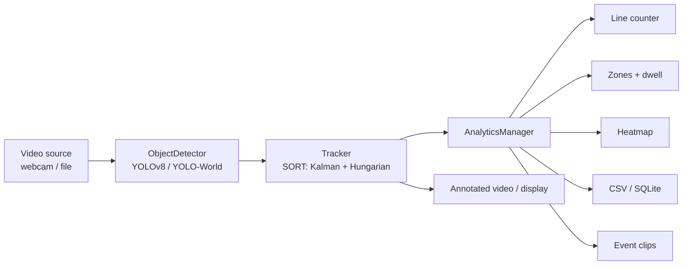

# FlowCount — Real-Time Traffic Analytics


Detect, track, **and count** vehicles in real time from any camera or video file.
FlowCount turns raw footage into actionable traffic metrics: per-class vehicle
counts at a line, lane occupancy and dwell time, congestion heatmaps, and
auto-saved clips of every crossing.


> The GIF above is the **synthetic demo** (`python scripts/demo.py`) — it runs the
> real detection→tracking→analytics pipeline with no model or camera required, so
> anyone can see it work in seconds. Point it at real footage with
> `python scripts/demo.py --input traffic.mp4`.

---

## Features

- 🚗 **Vehicle detection** — YOLOv8 (80 COCO classes) with automatic fallback to
  open-vocabulary **YOLO-World** for anything outside COCO.
- 🆔 **Multi-object tracking** — custom **SORT** (Kalman filter + Hungarian
  matching), class-aware so a truck never inherits a car's ID.
- 🔢 **Line-crossing counts** — per-class **in/out** tallies as objects cross a
  virtual line.
- 🅿️ **Zones, occupancy & dwell time** — define polygons; get enter/exit events
  and how long each object lingered.
- 🔥 **Congestion heatmap** — accumulated activity, rendered as an overlay and a
  saved image.
- 🎬 **Event-triggered clips** — pre/post-roll recording around each event.
- 💾 **Data export** — per-frame tracks + events to **CSV** or **SQLite**.
- ⚙️ **Config-driven** — `config.yaml` defaults, overridable per flag.
- 🧪 **Tested** — 48 unit tests; clean package layout; structured logging.

| Lane-activity heatmap |
|---|
|  |

---

## Quickstart

### Zero-setup demo (no model, no camera)
```bash
python scripts/demo.py          # writes assets/demo.gif, demo.mp4, heatmap.jpg
```

### Run on real footage
```bash
# Count vehicles crossing a line halfway down a 1280x720 clip
python main.py --input traffic.mp4 --preset traffic \
    --count-line 640,0,640,720 --heatmap --export-csv runs/traffic.csv

# Add a zone + record a clip on every event
python main.py --input traffic.mp4 --preset traffic \
    --zone 300,200,900,200,900,500,300,500 --dwell 5 \
    --record-events runs/clips
```

Controls (live window): `q`/`ESC` quit · `p` pause · `s` save frame.

---

## How it works



Everything flows through one reusable [`Pipeline`](src/pipeline.py)
(`process_frame() -> ProcessResult`), so the CLI, the demo generator, and the
upcoming web dashboard all share the exact same detect→track→analyze path.

---

## Setup

```bash
# Conda (recommended)
conda env create -f environment.yml
conda activate ml

# or pip
pip install ultralytics opencv-python filterpy scipy numpy pyyaml imageio rich
```

The first real run downloads the YOLOv8 weights automatically. A CUDA GPU is
used when available (FP16); otherwise it falls back to CPU. The synthetic demo
needs none of the model dependencies.

---

## CLI reference (highlights)

| Flag | Description |
|---|---|
| `--input`, `-i` | `0` for webcam, or a video file path (required) |
| `--preset` | `traffic` · `lab` · `office` · `tools` · `general` · `none` |
| `--classes` | Explicit class list (auto-enables YOLO-World if non-COCO) |
| `--count-line x1,y1,x2,y2` | Add a line-crossing counter (repeatable) |
| `--zone x1,y1,...` | Add a polygon zone (repeatable, ≥3 points) |
| `--dwell SECONDS` | Emit a dwell event past this duration in a zone |
| `--heatmap` | Accumulate + save an activity heatmap |
| `--export-csv` / `--export-db PATH` | Export tracks + events |
| `--record-events DIR` | Save pre/post-roll clips on events |
| `--output`, `-o` | Write the annotated video |
| `--config` / `--log-level` | Config file path / logging verbosity |

---

## Project structure

```
main.py                 CLI driver over the Pipeline
config.yaml             default settings (detector/tracker/viz/...)
scripts/demo.py         synthetic + real demo asset generator
src/
  detector.py           YOLOv8 / YOLO-World ObjectDetector
  tracker.py            SORT tracker (Kalman + Hungarian), class-aware
  pipeline.py           reusable detect->track->annotate Pipeline
  video_source.py       webcam / file source abstraction
  visualization.py      box / id / speed / trajectory drawing
  config.py             typed config loader
  analytics/            line counter, zones, heatmap, recorder, exporters, manager
tests/                  48 unit tests (pytest)
```

---

## Roadmap

- [x] **Foundation** — package layout, logging, config, reusable `Pipeline`, tests
- [x] **Analytics** — line counts, zones + dwell, heatmap, event clips, CSV/SQLite
- [ ] **Web dashboard** — FastAPI + WebSocket live stream + stats panel
- [ ] **Smarter tracking** — ByteTrack two-stage association; real-world **km/h**
      speed via homography calibration
- [ ] **Performance** — ONNX/TensorRT export, async pipeline, benchmark suite
- [ ] **Polish** — `pyproject.toml`, CI, Docker, pre-commit

---

## Development

```bash
pytest          # run the test suite
```

## License

MIT — see [LICENSE](LICENSE).
