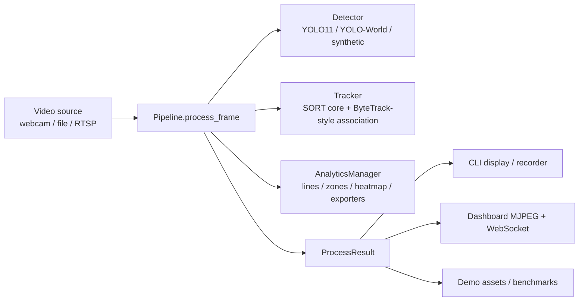
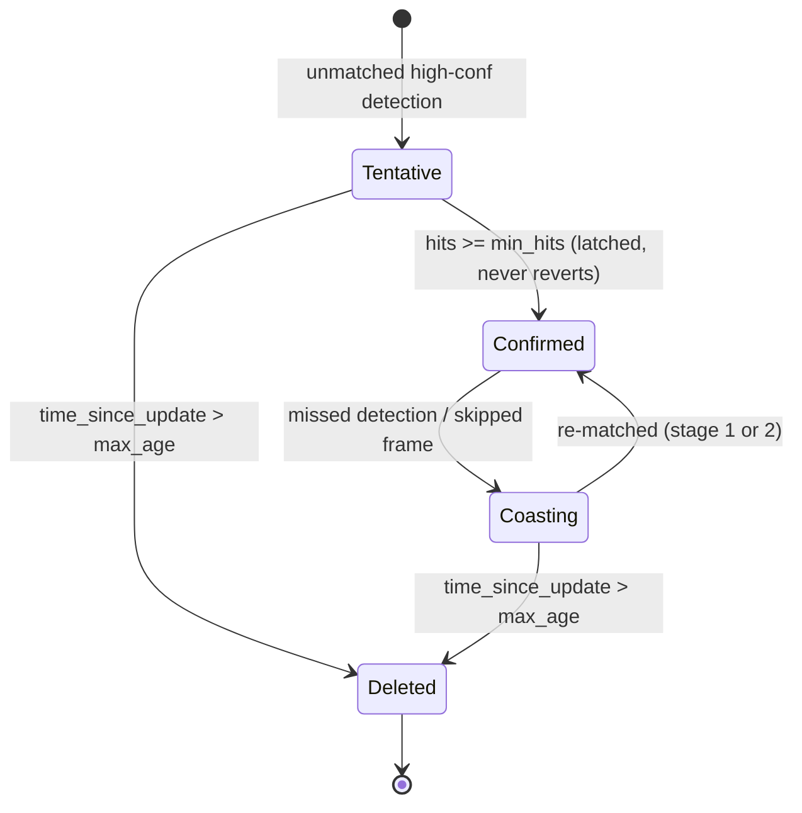

# FlowCount — Design Notes

How the pieces fit, and why they're shaped the way they are. File references
point at modules rather than line numbers, which drift.

## One pipeline, three frontends

Everything flows through a single reusable unit, `Pipeline` in
`flowcount/pipeline.py`:

```
process_frame(frame, *, annotate=True, timestamp=None) -> ProcessResult
```

`ProcessResult` carries the (optionally annotated) frame, raw detections,
tracks, per-frame `FrameStats`, and any analytics `Event`s. The CLI
(`flowcount/cli.py`), the web dashboard (`flowcount/web/server.py`), the demo
asset generator (`scripts/demo.py`), and the benchmark harness
(`scripts/bench.py`) all drive this one method; none of them owns a private
detect→track loop.



The pipeline is deliberately duck-typed: `detector` is anything with
`detect(frame) -> list[Detection]`, `tracker` anything with
`update(detections) -> list[Track]` (plus `predict_only()` if frame-skipping
is enabled). That one decision buys three things:

- **A synthetic mode.** `flowcount/synthetic.py` implements the detector
  protocol with a scripted traffic scene, so the full pipeline — tracking,
  analytics, dashboard — runs with no model, camera, or GPU. The hosted demo
  and the README GIF are this mode.
- **Torch-free tests.** The suite stubs detectors/trackers or uses the
  synthetic scene; `flowcount/detector.py` imports `torch`/`ultralytics`
  lazily inside `ObjectDetector.__init__`, so nothing in the test path pulls
  the ML stack.
- **Honest benchmarks.** `scripts/bench.py` swaps detectors to isolate
  framework overhead from model inference.

## Tracking

`flowcount/tracker.py` is a SORT core with ByteTrack-style association layered
on top. Each track is a Kalman filter over the constant-velocity state
`[x, y, s, r, vx, vy, vs]` (center, scale = area, aspect ratio, and their
velocities; aspect ratio is modeled as constant). Data association is
Hungarian assignment (`scipy.optimize.linear_sum_assignment`) on the negated
IOU matrix, gated by `iou_threshold`; with `class_aware=True` the IOU of
cross-class pairs is left at zero so a truck can never inherit a car's ID.

Association runs in two stages, following ByteTrack's key insight that
low-confidence detections are usually occluded objects, not noise:

1. **High pool** — detections with `confidence >= track_high_thresh` (default
   0.5) match against all predicted tracks. Only unmatched *high* detections
   may spawn new tracks.
2. **Low pool** — detections in `[track_low_thresh, track_high_thresh)`
   (default `[0.1, 0.5)`) match only against tracks stage 1 left unmatched.
   They can keep an existing track alive through partial occlusion but never
   create one.

Track lifecycle:



Two output rules matter for stable downstream analytics:

- **Confirmed latch.** Once a track accumulates `min_hits` detections (the
  spawning detection counts as the first), it stays confirmed for life.
  Without the latch, one missed frame would demote a track and its
  re-confirmation delay would flicker IDs through every analyzer. Note that
  hits are cumulative rather than consecutive — a deliberate simplification
  vs. SORT's hit-streak. During the first `min_hits` frames of a session,
  tentative tracks are emitted as a startup grace but are *not* latched; they
  still have to earn confirmation.
- **Output coast.** `update()` emits confirmed tracks missed for up to
  `output_coast` frames (default 1) at their predicted position, so a single
  dropped detection doesn't blink a box off screen or punch a hole in a line
  counter's trajectory. `output_coast` is denominated in *missed detection
  frames*: when `detect_every=N`, the Pipeline scales the raw-frame window to
  `(output_coast + 1) * N - 1` so one missed detection is absorbed regardless
  of the skip rate.

`predict_only(max_coast)` advances every filter one step with no detections
and emits confirmed tracks within the coast window — the tracker half of
detect-every-N (below).

**Deviations from the ByteTrack paper**, deliberately, for scope: affinity is
IOU-only (no re-ID appearance features), matching is a single Hungarian pass
per stage without Kalman-gated (Mahalanobis) cost, there is no separate
lost-track buffer with re-activation logic (the coast window plus `max_age`
covers it), and no camera-motion compensation. These are the right trade-offs
for fixed traffic cameras, which is the product's framing.

## Live mode

Real-time video has two independent problems: the model is slower than the
camera, and naive capture buffers stale frames. Live mode addresses them
separately:

- **detect-every-N** (`Pipeline(detect_every=N)`): the detector runs on every
  Nth frame; between detections, tracks coast on Kalman prediction via
  `predict_only(max_coast=N)`. Analytics consume tracks, not detections, so
  counters and zones keep working on coasted frames. `FrameStats.detection_ran`
  keeps the skipping observable. This trades detection latency (up to N-1
  frames) for roughly N× display throughput — the main lever on CPU.
- **`LatestFrameGrabber`** (`flowcount/video_source.py`): a daemon thread
  reads the source continuously into a single newest-frame slot; `read()`
  blocks until a frame newer than the last one handed out arrives. Slow
  inference therefore drops frames instead of accumulating end-to-end delay —
  latency stays bounded at roughly one inference time.
- **`StreamSource`**: RTSP/HTTP capture via FFmpeg with reconnect-and-
  exponential-backoff on read failure, so a network camera hiccup degrades to
  a missed frame rather than ending the session the way end-of-file does.

`--live` on both the CLI and `flowcount-web` wires these together and defaults
`detect_every` to 3.

## Dashboard threading

`DashboardEngine` (`flowcount/web/server.py`) runs the pipeline on one worker
thread and publishes results as immutable-ish snapshots behind a lock: the
latest JPEG bytes, a stats dict, and a monotonically increasing frame sequence
number. HTTP and WebSocket handlers only ever read snapshots, so an arbitrary
number of slow clients can never backpressure inference — they just observe
older frames.

Details that took thought:

- **Event history, not per-tick events.** The worker ticks at up to ~20 Hz
  while the WebSocket pushes at 5 Hz; publishing only "this tick's events"
  silently dropped ~75% of crossings. Events accumulate in a
  `deque(maxlen=EVENT_HISTORY)` instead, so every consumer sees every event.
- **Seq-gated MJPEG.** The `/video` generator yields only when the frame
  sequence number advances, instead of re-sending identical JPEGs on a fixed
  timer.
- **Async warmup.** `start()` returns immediately and the first tick happens
  on the worker thread; with a real model that first tick includes the
  multi-second ultralytics import and weight load. Endpoints serve an explicit
  `"warming"` state until the first frame lands, so the page loads instantly.
- **`/healthz`** reports worker liveness and last-tick age for Docker and
  hosted-deploy health checks — a silently dead worker thread would otherwise
  present as a frozen-but-200 dashboard.

The engine holds all dashboard state in-process, so the server is
single-worker by design; scaling out would give each worker a diverging
dashboard.

## Time semantics

`FrameContext.timestamp` feeds every time-based analytic (dwell, event
timestamps). Wall-clock time is correct for live sources but wrong for files:
a dwell threshold would then depend on how fast this machine processes video.
`process_frame` therefore accepts an optional `timestamp`, and the CLI passes
`frame_count / source_fps` for file input while live sources default to
wall-clock.

Velocity has one honest unit: `Track.velocity` is the Kalman state's
`(vx, vy)` in **pixels per frame**, and the overlay labels it `px/fr`.
Converting to real-world km/h needs a ground-plane homography (planned:
`calibration` + a `SpeedEstimator` analyzer); until then the code refuses to
pretend pixels are meters.

## Safety monitoring

The `flowcount/safety/` subpackage answers "is something wrong right now" for a
monitored zone — an AI grade-crossing monitor, generalized. Every detector is an
ordinary `Analyzer`, so nothing in the detection or tracking path knows it
exists; they consume the same `FrameContext` and emit the same `Event`s.

Three design decisions carry most of the weight:

- **Incidents are anchored to a location, not a track ID.** A SORT tracker
  reassigns IDs after an occlusion, and class-aware matching spawns a fresh ID
  when a detection's class flips (car → truck on a partially occluded box). If a
  stall timer lived on the track, either event would silently reset it and the
  alert would never fire. So an `Incident` owns `(anchor, anchor_size,
  first_still_ts)` and tracks *associate* to it. Symmetrically, **absence is not
  clearance**: an occluding truck must not clear a live hazard, so the incident
  holds through an occlusion-grace window.
- **Stillness is scale-invariant, not Kalman velocity.** `Track.velocity` is
  px/*frame* (meaning changes with FPS and `detect_every`, and it is non-zero
  while a track coasts). Stillness instead requires *both* a high self-IoU at a
  time lag and a small size-normalised displacement radius — two metrics whose
  failure modes are uncorrelated.
- **Geometry moves, pixels don't.** The camera stabilizer matches each frame to
  a stored keyframe (never chaining frame-to-frame, which random-walks) and
  publishes a 3×3 transform on `FrameContext.transform`. Analyzers map their
  points through it; the frame itself is never warped, so the recorder and the
  MJPEG stream keep showing exactly what the camera produced. A sustained
  reposition suspends the incident timers via `StabilityMonitor`, which is why
  `process_frame` must thread the frame timestamp into `estimate()`.

Alerts leave the frame thread immediately: `AnalyticsManager` hands fired events
to an `AlertDispatcher` that filters by severity, flattens to a plain dict, and
delivers on a background worker (`LogSink`, `WebhookSink`) — a slow webhook can
never stall detection.

## Edge deployment

`torch`/`ultralytics` are lazy-imported inside `ObjectDetector`, so the whole
tracker/analytics/safety/dashboard stack imports and runs with no ML stack —
which is what lets a Jetson boot the synthetic dashboard before any weights are
installed. For real inference, `ObjectDetector` loads a serialized TensorRT
`.engine` (or `.onnx`) through the same `YOLO(...)` interface and skips the
`.to(device)` / `half=` handling that a serialized model bakes in at export.
`flowcount-export` produces the engine on the deployment board (engines are
device- and version-locked), and `Dockerfile.jetson` / `docs/jetson.md` cover the
rest of the aarch64 packaging boundary.

## Testing strategy

The suite (199 tests) runs with zero ML dependencies by construction:

- Pipeline logic is tested with stub detectors/trackers.
- Tracker behavior — both association stages, the confirmed latch, coast
  mode, detect-every-N ID stability — is tested against the real Kalman
  filters (`filterpy` is a core dep, not an ML one).
- Video sources monkeypatch `cv2.VideoCapture`, so webcam/stream/file routing
  and reconnect logic run without hardware.
- The dashboard is tested end-to-end through FastAPI's `TestClient` driving
  the real engine on the synthetic scene, including the warming state and
  event accumulation.
- Safety detectors are tested both as units (hand-built `FakeTrack`s) and
  end-to-end through the real Pipeline + Tracker over the synthetic scene, so
  Kalman coasting and ID churn are actually exercised. The Jetson engine path
  and `flowcount-export` are tested by injecting a fake `ultralytics`/`torch`
  into `sys.modules`, so they run in the same torch-free CI.

That keeps CI at a pip install and a pytest run on every push — no model
downloads, no GPU runners — which is exactly why it can gate every commit.
